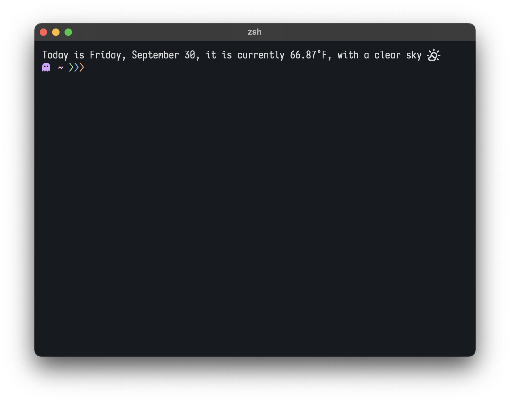

# random things i make

## OpenWeatherMap Python Script 

>\>python3 ~/Downloads/(script).py

A [nerd font](https://www.nerdfonts.com/) will have to be enabled  in your terminal for the dynamic icon. An [OpenWeatherMap](https://openweathermap.org/) key will be required to get weather data. 

The configuration file is located in **~/.config/weather_conf.json**
